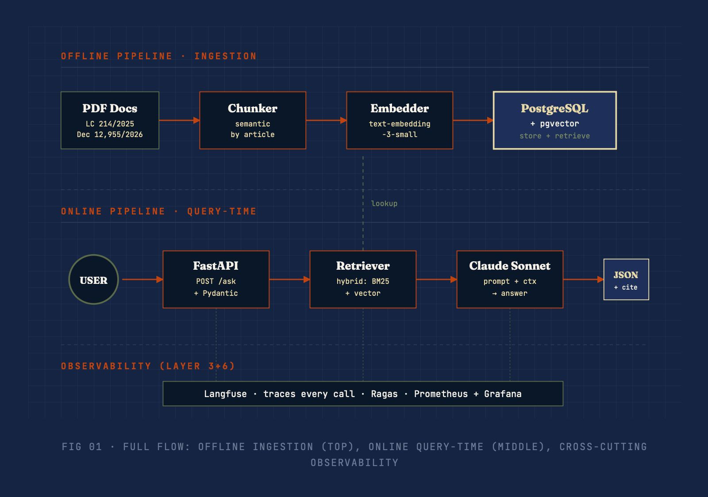

# IBS/CBS Copilot



> Open-source RAG for questions on Brazil's Tax Reform (IBS/CBS), grounded in
> LC 214/2025, EC 132/2023, and Decree 12,955/2026.

**Status:** in development. Day 7/10.

## What it does

Answers Portuguese questions about the Tax Reform, citing exact articles.

## Stack

- FastAPI + Pydantic
- PostgreSQL + pgvector
- Claude Sonnet 4.6
- Ragas + MLflow (evaluation)
- Langfuse (observability)
- GitHub Actions (CI/CD with eval gates)
- Fly.io (deploy)

See [ARCHITECTURE.md](ARCHITECTURE.md) for technical decisions.

## Local setup

```bash
# 1. Download source PDFs
# See docs/download-sources.md

# 2. Start infra
docker compose up -d

# 3. Apply schema
docker compose exec -T postgres psql -U copilot -d copilot < migrations/001_init.sql

# 4. Install
poetry install

# 5. Configure
cp .env.example .env  # fill in OPENAI_API_KEY, ANTHROPIC_API_KEY

# 6. Process + ingest
poetry run python -m src.copilot.ingestion.pdf_to_text \
    --input data/raw/lc_214_2025.pdf --output data/processed/lc214.txt

poetry run python -m src.copilot.ingestion.ingest \
    --input data/processed/lc214.txt --source "LC 214/2025"

# Repeat for EC 132 and Decree 12,955
```

## Try the retrievers

Manual smoke test comparing vector, BM25, and hybrid on 10 queries:

```bash
poetry run python scripts/compare_retrievers.py
```

Or open `notebooks/03_retrieval_eyeball.ipynb` for the interactive version.

## Try the full pipeline

End-to-end question answering (retrieve → generate → cite):

```bash
poetry run python scripts/try_pipeline.py
```

## Run the API

Full system in Docker (API + Postgres + Redis):

```bash
docker compose up --build
```

Then:

```bash
curl -X POST http://localhost:8000/v1/ask \
  -H "Content-Type: application/json" \
  -d '{"question": "Qual a alíquota do IBS?"}'
```

Interactive docs at http://localhost:8000/docs.

### Endpoints

| Method | Path          | Description                                  |
| ------ | ------------- | -------------------------------------------- |
| GET    | `/v1/health`  | Health check                                 |
| GET    | `/v1/sources` | Indexed source documents                     |
| POST   | `/v1/ask`     | Ask a question (rate-limited: 10/min per IP) |

## Project structure

src/copilot/
├── ingestion/ # PDF → chunks → embeddings → Postgres
├── retrieval/ # hybrid vector + BM25 with RRF
├── generation/ # Claude prompt + structured citations
├── api/ # FastAPI + cache + rate limiting + prometheus metrics
└── observability/ # Langfuse tracing + LLM-as-judge sampling

evals/
├── golden/ # golden question sets (versioned)
├── metrics/ # custom metrics (citation_accuracy)
└── run_ragas.py # eval driver + MLflow tracking

## Evaluation

Baseline results on the 30-question golden set (`v0-baseline`, top_k=5):

| Metric             | Score | Target |
| ------------------ | ----- | ------ |
| Faithfulness       | 0.790 | > 0.85 |
| Answer Relevance   | 0.528 | > 0.80 |
| Context Precision  | 0.523 | > 0.75 |
| Context Recall     | 0.435 | > 0.75 |
| Citation Precision | X.XX  | —      |
| Citation Recall    | X.XX  | —      |
| Citation F1        | X.XX  | —      |

Fill in citation scores after re-run.

Run evals:

```bash
poetry run python evals/run_ragas.py --run-name v0-baseline --top-k 5
```

Open MLflow UI:

```bash
poetry run mlflow ui --backend-store-uri sqlite:///mlflow.db --port 5000
```

## Observability

Two-layer monitoring stack:

- **Langfuse** — LLM traces, tokens, cost. Hierarchical spans (`answer_question` → `retrieve` + `generate`).
- **LLM-as-judge** — 10% of traffic sampled and scored on faithfulness (Haiku 4.5, cheap judge). Score posted back to the trace.
- **Prometheus** — infra metrics via `/metrics`: request count by endpoint+status, error count, request latency histogram.

Sign up at [Langfuse Cloud](https://cloud.langfuse.com) and set the keys in `.env`:

Prometheus endpoint:

```bash
curl http://localhost:8000/metrics
```

## Downloading the source documents

The copilot ingests 4 official documents. They're not committed to the repo (too large, and it's cleaner to fetch fresh copies). Follow the steps below and save everything under data/raw/.

### 1. Complementary Law 214/2025

The main law establishing IBS, CBS, and IS.

Open https://www.planalto.gov.br/ccivil_03/leis/lcp/lcp214.htm
If you see a "Texto compilado" link at the top, click it — that's the version with all amendments applied.
Press Ctrl + P → Destination: Save as PDF → Portrait, default margins.
Save as data/raw/lc_214_2025.pdf.

### 2. Constitutional Amendment 132/2023

The constitutional foundation of the Tax Reform.

Open https://www.planalto.gov.br/ccivil_03/constituicao/emendas/emc/emc132.htm
Same routine: Ctrl + P → Save as PDF.
Save as data/raw/ec_132_2023.pdf.

### 3. Decree 12,955/2026

The executive regulation of the CBS.

From the LC 214 page (step 1 above), click the link labeled (Vide Decreto nº 12.955, de 2026) at the top.
If that link isn't there, Google site:planalto.gov.br decreto 12955 2026.
Ctrl + P → Save as PDF.
Save as data/raw/decreto_12955_2026.pdf.

### 4. Technical Note NT 2025.002 v.1.50 (optional, v2 scope)

Open https://www.nfe.fazenda.gov.br/portal/listaConteudo.aspx?tipoConteudo=04BIfIQt1aY=
Under "Documentos vigentes", find NT 2025.002 with the highest version number (currently v.1.50).
Click it. Download the PDF directly (no Save-as-PDF needed).
Save as data/raw/nt_2025_002_v150.pdf.
Verification

After downloading, scroll to the end of each PDF to confirm the full text was captured (browsers sometimes truncate very long pages during print).

Expected sizes, roughly:

lc_214_2025.pdf — 3–5 MB
ec_132_2023.pdf — 500 KB
decreto_12955_2026.pdf — 1–2 MB

If any file is significantly smaller, re-download.
