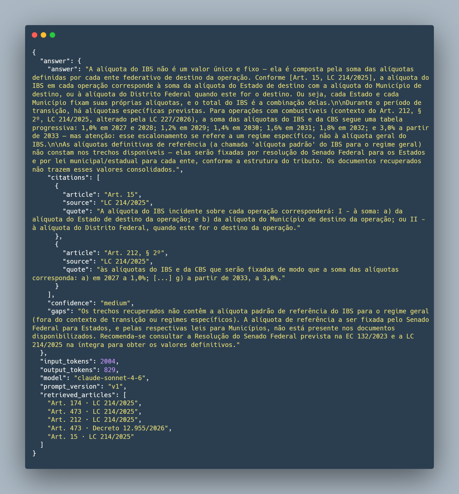

# IBS/CBS Copilot

[](https://github.com/Juniordell/ibs-cbs-copilot/actions/workflows/ci.yaml)
[](https://github.com/Juniordell/ibs-cbs-copilot/actions/workflows/eval.yaml)
[](https://ibs-cbs-copilot.fly.dev/v1/health)


---

## The problem

Brazil's Tax Reform goes live on **August 1st, 2026**. Complementary Law
214/2025 introduces three new taxes (IBS, CBS, IS), affecting millions of
companies. Accountants are overwhelmed, and generic LLMs hallucinate in this
legal domain — inventing article numbers and paraphrasing regulations
incorrectly.

## The solution

A RAG system that answers Portuguese questions about the Tax Reform, citing
exact articles from the primary sources. Refuses to answer when the retrieved
context doesn't cover the question — no hallucinated law.

## Demo

```bash
curl -X POST https://ibs-cbs-copilot.fly.dev/v1/ask \
  -H "Content-Type: application/json" \
  -d '{"question": "Qual a alíquota do IBS?"}'
```



## Metrics (v0 baseline)

Measured on a 30-question golden set (`evals/golden/golden_v1.jsonl`):

| Metric                    | Score   | Target  |
| ------------------------- | ------- | ------- |
| Faithfulness (Ragas)      | 0.79    | > 0.85  |
| Answer Relevance (Ragas)  | 0.53    | > 0.80  |
| Context Precision (Ragas) | 0.52    | > 0.75  |
| Context Recall (Ragas)    | 0.43    | > 0.75  |
| Citation F1 (custom)      | 0.61    | —       |
| p95 latency               | ~2.1s   | < 3s    |
| Cost per query            | ~$0.008 | < $0.02 |

**v0 diagnosis:** answers are grounded (Faithfulness 0.79), but the retriever
misses relevant chunks (Recall 0.43). Retrieval is the bottleneck, not
generation. Next iterations: raise `top_k`, revisit chunker, try a
cross-encoder reranker.

## Architecture


**Offline pipeline (ingestion):**
PDFs → PyMuPDF text extraction → legal-aware chunking (by `Art.`, `§`) →
OpenAI embeddings → PostgreSQL with pgvector.

**Online pipeline (query):**
User question → hybrid retrieval (vector + BM25 + Reciprocal Rank Fusion) →
Claude Sonnet 4.6 with grounded prompt → structured JSON with citations.

**Observability:** Langfuse (LLM traces, tokens, cost, LLM-as-judge scoring on
10% of traffic) + Prometheus (`/metrics` endpoint).

Full technical decisions and rationale in [ARCHITECTURE.md](ARCHITECTURE.md).

## Stack

| Layer         | Technology                                       |
| ------------- | ------------------------------------------------ |
| LLM           | Claude Sonnet 4.6 (Anthropic)                    |
| Embeddings    | OpenAI `text-embedding-3-small`                  |
| Vector store  | PostgreSQL 16 + pgvector                         |
| Cache         | Redis (Upstash)                                  |
| Framework     | FastAPI + Pydantic                               |
| Evaluation    | Ragas + MLflow + custom metrics                  |
| Observability | Langfuse + Prometheus                            |
| CI/CD         | GitHub Actions with eval gates                   |
| Deploy        | Fly.io (API) + Neon (Postgres) + Upstash (Redis) |

## Endpoints

| Method | Path          | Description                                  |
| ------ | ------------- | -------------------------------------------- |
| GET    | `/v1/health`  | Health check                                 |
| GET    | `/v1/sources` | Indexed source documents                     |
| POST   | `/v1/ask`     | Ask a question (rate-limited: 10/min per IP) |
| GET    | `/metrics`    | Prometheus metrics                           |
| GET    | `/docs`       | Interactive Swagger UI                       |

## Project structure

```
src/copilot/
├── ingestion/        # PDF → chunks → embeddings → Postgres
├── retrieval/        # hybrid vector + BM25 with RRF
├── generation/       # Claude prompt + structured citations
├── api/              # FastAPI + Redis cache + rate limit + Prometheus
└── observability/    # Langfuse tracing + LLM-as-judge sampling

evals/
├── golden/           # golden question sets (versioned)
├── metrics/          # custom metrics (citation_accuracy)
├── fixtures/         # CI test data
├── run_ragas.py      # eval driver + MLflow tracking
└── check_gate.py     # CI eval gate (fails PR on regression)

.github/workflows/
├── ci.yml            # lint + tests on every push
└── eval.yml          # Ragas gate on PRs (blocks quality regression)
```

## Local setup

**Prerequisites:** Docker, Python 3.11, Poetry 2.x

```bash
# 1. Download source PDFs — see docs/download-sources.md
# Place them under data/raw/

# 2. Configure secrets
cp .env.example .env
# Fill in OPENAI_API_KEY, ANTHROPIC_API_KEY, LANGFUSE_*

# 3. Start infra
docker compose up -d

# 4. Install
poetry install --with dev

# 5. Apply migrations
make migrate-local

# 6. Process + ingest
poetry run python -m src.copilot.ingestion.pdf_to_text \
  --input data/raw/lc_214_2025.pdf \
  --output data/processed/lc214.txt

poetry run python -m src.copilot.ingestion.ingest \
  --input data/processed/lc214.txt \
  --source "LC 214/2025"

# Repeat for EC 132 and Decree 12,955

# 7. Run
docker compose up --build
```

## Testing

```bash
# Unit + integration tests
make test

# Retrieval smoke test (compare Vector / BM25 / Hybrid)
poetry run python scripts/compare_retrievers.py

# Full pipeline smoke test
poetry run python scripts/try_pipeline.py

# Ragas eval (~10 min, ~$0.50)
poetry run python evals/run_ragas.py \
  --dataset evals/golden/golden_v1.jsonl \
  --run-name v0-baseline \
  --top-k 5

# Open MLflow UI
poetry run mlflow ui --backend-store-uri sqlite:///mlflow.db --port 5000
```

## CI/CD

Every push:

- **Lint** (ruff) + **tests** (pytest with Postgres service container)

Every PR touching `src/copilot/**` or `evals/**`:

- **Ragas gate** on the golden set
- PR fails if `faithfulness < 0.75` or `answer_relevance < 0.48`
- Metrics posted as a PR comment

Thresholds are calibrated to baseline − 0.05 to catch regression, not
perfection. They raise as the system improves.

## Deployment

- **API** on [Fly.io](https://fly.io) (São Paulo, auto-sleep when idle)
- **Postgres** on [Neon](https://neon.tech) (managed, pgvector, sa-east-1)
- **Redis** on [Upstash](https://upstash.com) (São Paulo, TLS)

Config in `fly.toml`. Secrets managed via `flyctl secrets set`.

```bash
flyctl deploy --app ibs-cbs-copilot
```

## Roadmap

- [ ] Bump `top_k` and re-evaluate — target Recall > 0.60
- [ ] Add a cross-encoder reranker (Cohere or ColBERT)
- [ ] Streaming responses via Server-Sent Events
- [ ] Streamlit UI at `/app` for non-technical users
- [ ] Ingest NT 2025.002 (NF-e technical spec) for ERP developer queries
- [ ] Multi-tenant + per-user rate limiting

## License

MIT. See [LICENSE](LICENSE).

## Author

Built by [Nelson Dell](https://linkedin.com/in/nelson-dell) as a public
learning artifact in AI Engineering. Not affiliated with the Brazilian
Federal Government or any tax authority.
